# API Gateway & Frontend Routing Management

## Overview

This document outlines the comprehensive routing architecture of the KASM-Pro application, featuring a **NestJS API Gateway** for backend microservices routing and dynamic frontend route management for optimal maintainability and developer experience.

## 🏛️ System Architecture

### Backend: NestJS API Gateway Architecture


### API Gateway Features

- **🔐 Centralized Authentication**: JWT validation and user context
- **🚦 Rate Limiting**: Multi-tier protection (100/15min, 1000/hour, 5000/day)
- **⚡ Caching**: Redis-based response caching with 5-minute TTL
- **🔄 Circuit Breaker**: Fault tolerance for downstream services
- **📊 Health Monitoring**: Comprehensive health checks and metrics
- **🌐 WebSocket Proxy**: Real-time terminal connections
- **🛡️ Security**: Helmet.js, CORS, request sanitization

### API Route Mapping

```typescript
// Authentication Routes
POST /api/v1/user/login        -> auth-service:3000
POST /api/v1/user/register     -> auth-service:3000
GET  /api/v1/user              -> auth-service:3000
GET  /api/v1/auth/status       -> auth-service:3000

// Environment Management
POST /api/v1/environment       -> environment-service:3001
GET  /api/v1/environments      -> environment-service:3001

// Challenge System
GET  /api/v1/challenges        -> challenge-service:3002
GET  /api/v1/challenge         -> challenge-service:3002

// Progress Tracking
GET  /api/v1/progress          -> progress-service:3003
POST /api/v1/progress          -> progress-service:3003

// Terminal Operations
HTTP: ALL  /terminal/*         -> terminal-service:3004
WebSocket: /terminal/socket.io -> terminal-service:3004
```

## Frontend Architecture Patterns

### 🔄 Frontend Route Flow & Navigation Logic


## File Structure & Organization

```
src/routes/
├── routes.tsx              # 🎯 Main routing orchestrator
├── auth.routes.tsx          # 🔐 Authentication routes
├── dashboard.routes.tsx     # 📊 Dashboard routes
├── home.routes.tsx          # 🏠 Root path handling
├── error.routes.tsx         # ❌ Error & 404 handling
├── debug.routes.tsx         # 🐛 Development routes
└── paths/
    ├── auth.path.ts         # 🔗 Auth path constants
    └── dashboard.path.ts    # 🔗 Dashboard path constants
```

## Key Components

### 1. **AppRoutes (Main Orchestrator)**

```typescript
// Dynamic route selection based on authentication
const routes = isAuthenticated ? [...dashboardRoutes()] : [...authRoutes()];

// Combine all routes with proper precedence
const allRoutes = [
  ...homeRoutes(isAuthenticated),
  ...routes,
  ...debugRoutes(),
  ...errorRoutes(),
];
```

### 2. **Functional Route Definitions**

```typescript
// ✅ Good: Functional, flexible
export const dashboardRoutes = (): RouteObject[] => [...]

// ❌ Avoid: Static, inflexible
export const dashboardRoutes: RouteObject[] = [...]
```

### 3. **Path Constants**

```typescript
// Centralized path management
export const dashboardPath = {
  default: "/dashboard",
  home: "/dashboard/home",
  settings: "/dashboard/settings",
} as const;
```

## Scaling Guidelines

### 📈 Adding New Route Sections


#### Step-by-Step Process:

1. **Create Route File**: `src/routes/newSection.routes.tsx`

```typescript
export const newSectionRoutes = (): RouteObject[] => [
  {
    path: newSectionPath.default,
    element: <NewSectionLayout />,
    children: [
      { index: true, element: <NewSectionHome /> },
      { path: newSectionPath.settings, element: <NewSectionSettings /> },
    ],
  },
];
```

2. **Define Paths**: `src/routes/paths/newSection.path.ts`

```typescript
const defaultPath = "/new-section";

export const newSectionPath = {
  default: defaultPath,
  settings: `${defaultPath}/settings`,
} as const;
```

3. **Add to Main Router**: Update `routes.tsx`

```typescript
import { newSectionRoutes } from "./newSection.routes";

// Add to appropriate route group
const routes = isAuthenticated
  ? [...dashboardRoutes(), ...newSectionRoutes()]
  : [...authRoutes()];
```

### 🔐 Role-Based Route Access

```mermaid
graph TD
    A[User Request] --> B{Check Auth}
    B -->|❌ Not Auth| C[Auth Routes]
    B -->|✅ Authenticated| D{Check Role}
    D -->|Admin| E[Admin Routes]
    D -->|User| F[User Routes]
    D -->|Manager| G[Manager Routes]

    E --> H[Admin Dashboard]
    F --> I[User Dashboard]
    G --> J[Manager Dashboard]

    style D fill:#fff3e0
    style E fill:#ffebee
    style F fill:#e8f5e8
    style G fill:#f3e5f5
```



#### Implementation:

```typescript
// Enhanced auth hook
export const useAuth = () => {
  const [user] = useState({ role: "admin", isAuthenticated: true });

  return {
    isAuthenticated: user.isAuthenticated,
    role: user.role,
    hasRole: (role: string) => user.role === role,
  };
};

// Role-based route selection
const { isAuthenticated, role } = useAuth();
const routes = useMemo(() => {
  if (!isAuthenticated) return [...authRoutes()];

  const baseRoutes = [...dashboardRoutes()];
  if (role === "admin") baseRoutes.push(...adminRoutes());
  if (role === "manager") baseRoutes.push(...managerRoutes());

  return baseRoutes;
}, [isAuthenticated, role]);
```

## Best Practices

### ✅ Do's

1. **Use Functional Route Definitions**

   ```typescript
   // Allows dynamic behavior and parameters
   export const routes = (params?: any): RouteObject[] => [...]
   ```

2. **Centralize Path Constants**

   ```typescript
   // Single source of truth for paths
   export const paths = { home: "/home" } as const;
   ```

3. **Implement Lazy Loading**

   ```typescript
   const LazyComponent = lazy(() => import("./Component"));
   ```

4. **Use Nested Routes for Layouts**
   ```typescript
   {
     path: "/dashboard",
     element: <DashboardLayout />,
     children: [{ index: true, element: <Home /> }]
   }
   ```

### ❌ Don'ts

1. **Avoid Hardcoded Paths**

   ```typescript
   // ❌ Bad
   navigate("/dashboard/settings");

   // ✅ Good
   navigate(dashboardPath.settings);
   ```

2. **Don't Mix Authentication Logic in Components**

   ```typescript
   // ❌ Bad: Auth logic in component
   if (user.isAuthenticated) return <Dashboard />;

   // ✅ Good: Handle in routing layer
   ```

## Route-Based Context Management

### 🧠 Context Architecture


### Implementation Example:

```typescript
// Route-specific context provider
export const DashboardProvider = ({ children }: PropsWithChildren) => {
  const [breadcrumbs, setBreadcrumbs] = useState<string[]>([]);
  const [sidebarOpen, setSidebarOpen] = useState(true);

  return (
    <DashboardContext.Provider value={{
      breadcrumbs,
      setBreadcrumbs,
      sidebarOpen,
      setSidebarOpen,
    }}>
      {children}
    </DashboardContext.Provider>
  );
};

// Use in route definition
{
  path: dashboardPath.default,
  element: (
    <DashboardProvider>
      <DashboardLayout />
    </DashboardProvider>
  ),
  children: [...]
}
```

## Debugging & Development

### 🐛 Debug Routes

The system includes built-in debug routes for development:

- `/test` - Verify routing system functionality
- `/debug` - View current route information
- `/404` - Test error handling

### Route Debugging Tips:

1. **Enable Debug Mode**

   ```typescript
   const DEBUG = process.env.NODE_ENV === "development";

   if (DEBUG) {
     console.log("Current routes:", allRoutes);
     console.log("Auth state:", { isAuthenticated, isLoading });
   }
   ```

2. **Route Guards Debugging**
   ```typescript
   useEffect(() => {
     console.log("Route guard check:", {
       path: location.pathname,
       isAuthenticated,
       shouldRedirect: !isAuthenticated && !isUnauthenticatedPage,
     });
   }, [location, isAuthenticated]);
   ```

## Performance Optimization

### 🚀 Optimization Strategies

1. **Lazy Route Loading**

   ```typescript
   const Dashboard = lazy(() => import("../pages/Dashboard"));
   ```

2. **Route Preloading**

   ```typescript
   // Preload likely next routes
   const preloadRoute = (routePath: string) => {
     import(`../pages/${routePath}`);
   };
   ```

3. **Memoize Route Calculations**
   ```typescript
   const routes = useMemo(() => {
     return isAuthenticated ? dashboardRoutes() : authRoutes();
   }, [isAuthenticated]);
   ```

## Testing Strategy

### 🧪 Route Testing Approach

```typescript
// Test route rendering
test("renders dashboard for authenticated user", () => {
  const mockAuth = { isAuthenticated: true, isLoading: false };
  jest.spyOn(authHook, "useAuth").mockReturnValue(mockAuth);

  render(<AppRoutes />);
  expect(screen.getByText("Dashboard")).toBeInTheDocument();
});

// Test navigation logic
test("redirects to auth when not authenticated", () => {
  const mockAuth = { isAuthenticated: false, isLoading: false };
  const mockNavigate = jest.fn();

  // Test implementation
});
```

---

## Quick Reference

### 🎯 Essential Commands

```bash
# Create new route section
touch src/routes/newSection.routes.tsx
touch src/routes/paths/newSection.path.ts

# Test routes
curl http://localhost:4200/test
curl http://localhost:4200/debug
```

### 📋 Checklist for New Routes

- [ ] Create route file with functional export
- [ ] Define path constants
- [ ] Add to main router logic
- [ ] Update authentication checks if needed
- [ ] Add route-specific context if required
- [ ] Implement lazy loading for performance
- [ ] Add tests for route behavior
- [ ] Update documentation

---

_This routing system provides a solid foundation for scalable, maintainable navigation in your KASM-Pro application. The functional approach allows for dynamic behavior while maintaining clean separation of concerns._
